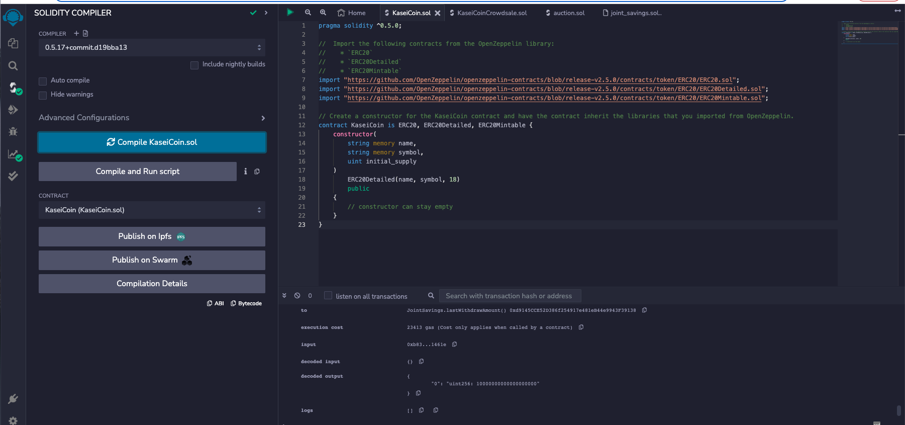
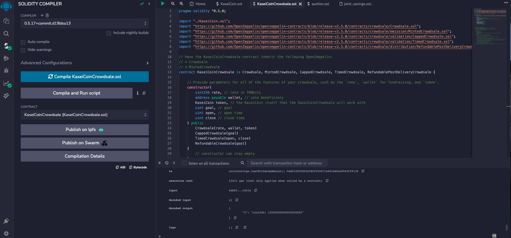

# Martian Token Crowdsale

## Background

After waiting for years and passing several tests, the Martian Aerospace Agency selected you to become part of the first human colony on Mars. As a prominent fintech professional, they chose you to lead a project developing a monetary system for the new Mars colony. You decided to base this new system on blockchain technology and to define a new cryptocurrency named **KaseiCoin**. (Kasei means Mars in Japanese.)

KaseiCoin will be a fungible token that’s ERC-20 compliant. You’ll launch a crowdsale that will allow people who are moving to Mars to convert their earthling money to KaseiCoin.

The steps for this assignment are divided into the following subsections:

1. Create the KaseiCoin Token Contract

2. Create the KaseiCoin Crowdsale Contract

3. Create the KaseiCoin Deployer Contract

4. Deploy and Test the Crowdsale on a Local Blockchain

5. Optional: Extend the Crowdsale Contract by Using OpenZeppelin

### Step 1: Create the KaseiCoin Token Contract

In this subsection, you’ll create a smart contract that defines KaseiCoin as an ERC-20 token. To do so, complete the following steps:

1. Import the provided `KaseiCoin.sol` starter file into the Remix IDE.

2. Import the following contracts from the OpenZeppelin library:

    * `ERC20`

    * `ERC20Detailed`

    * `ERC20Mintable`

Compile and Deploy Kaseicoin & Kaseicoincrowdsale

### EVALUATION EVIDENCE 

### Step 4: Deploy and Test the Crowdsale on a Local Blockchain

Ganache: 

Metamask:

